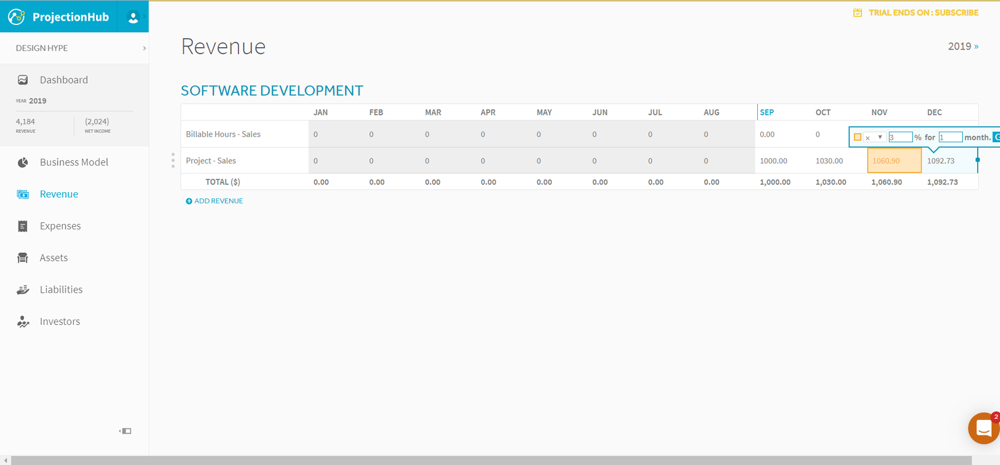
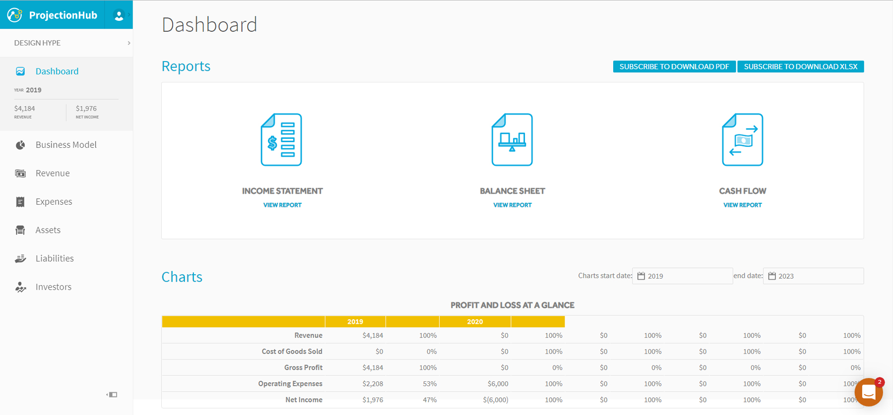
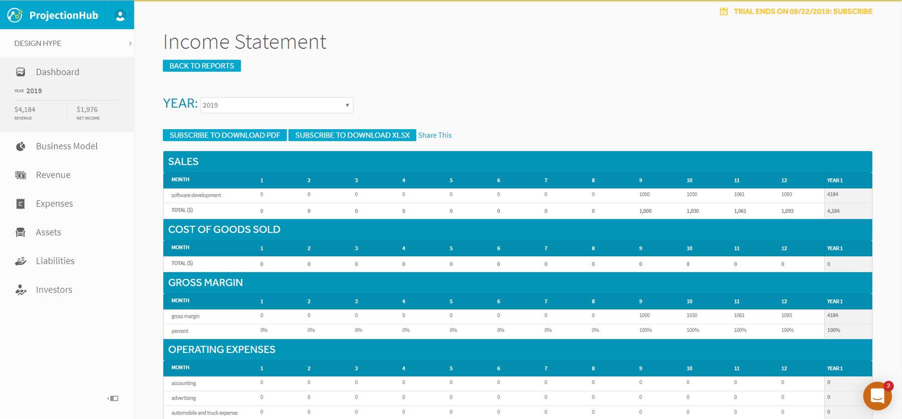
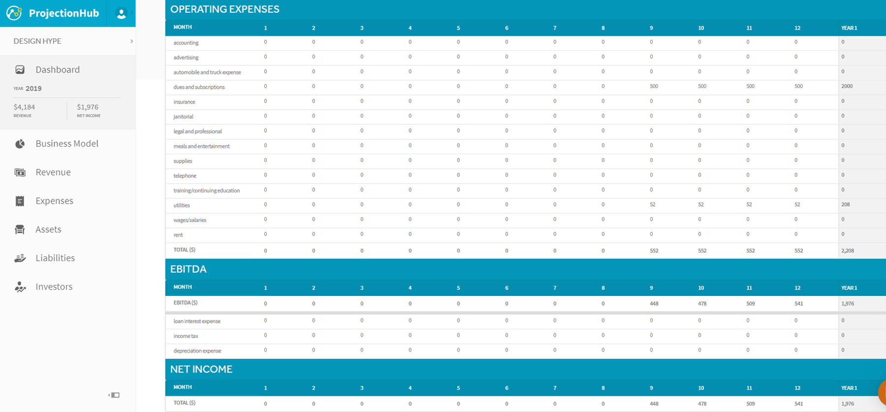

# Revenue

## Hero-Log will make money by...

*Charging users a monthly subscription fee using their credit or debit cards using Shopify or WooCommerce.*

## My competitors
*The CLZ is offering cloud sync to their database for a user’s collections. If the user spends more than $15 on the app, they will give the user unlimited collection space. (Austinhg, “What Is the Best App for Modern Comics Inventory?”) Customers are satisfied with this offer. ComicBase Professional offers free and paid software. Customers are content with this because of the satisfactory features of the software. (Albert, “Why You Should Use Comic Collecting Software”)*

## Projected income
*I project the income to be $1,976 the 1st year with incremental growth each year by 1.5% – 3%, initially. First year’s revenue will be $4,184 and the expenses will be $2,208.*

**

**

**

**

# Marketing

## Elevator Pitch

*There are apps that log a person’s library collection and some apps are specific to comic book collectors. However, the cost for some of those apps is not worth the features they offer. The application I’m building will initially satisfy basic needs, but two features will be added the following year and 3 the year after that. The cost to add the features will be low because I will implement the changes. As a result, the price of the app will not increase.*

## Keywords

*comic book, comic books, books, comic book collection, comic book collections, comic book collector, comic book collectors, comic book log, comic book logging, comic book logs, book collection, book collections, book collector, book collectors, collector, collectors, collection, collections, comic book collecting, collecting, comic book cataloging, cataloging, book cataloging, log books, log book, log comic book, log comic books, inventory comic books, inventory comic book, digital comic book inventory, digital comic book log, digital comic book logging*

# Change Orders

*Project Name:*

*Requested by:*

*Date:*

*Request Name:*

*Request Number:*

*Change Description:*

*Change Reason:*

*Impact of Change*
   - Scope:

  - Budget:

  - Timeline:

  - Resourcing:

  - Communications:

  - Other:

*Proposed Action:*

*Associated Cost:*

*Approved By:*

*Date:*

# References

*Austinhg. “What Is the Best App for Modern Comics Inventory?”, 16 January 2018. https://www.cgccomics.com/boards/topic/427352-what-is-the-best-app-for-modern-comics-inventory/*

*Albert, Aaron. “Why You Should Use Comic Collecting Software”, 31 December 2018. https://www.liveabout.com/comic-collecting-software-reviews-804293.*

